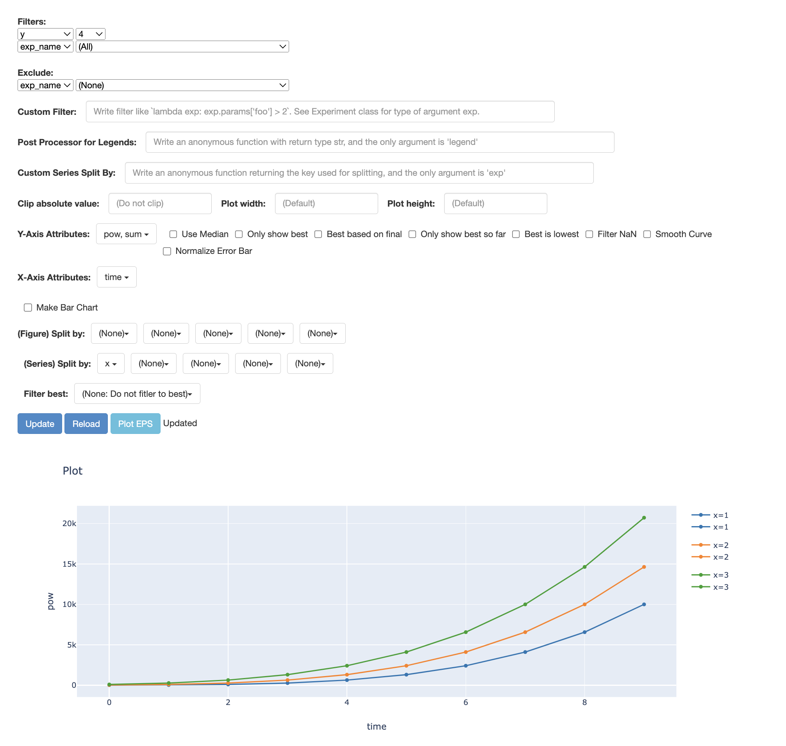

# LaunchKit
This repo aims to isolate the launching / hyperparameter sweep capabilities of [RLKit's Launcher](https://github.com/rail-berkeley/rlkit/blob/master/rlkit/launchers/launcher_util.py). Consult this repository for further documentation and explanation of settings, some of which may not be used in this repo.

## Getting started
Clone this repo and add its root directory to your pythonpath.

See the [test](testing/test.py) for example usage of launching an experiment with a hyperparameter sweep.
You will need to write an experiment function that accepts a dict of hyperparameter values and runs accordingly. Within this function, use
- `logger.record_dict(metrics: dict)` to queue a dictionary of metrics to be saved to disk as a row in that experiment directory's `progress.csv` file. This dict typically includes a `time` or `epoch` value that increments.
- `logger.dump_tabular()` every epoch to save the metrics to disk by adding a row to `progress.csv`.
- `logger.save_itr_params(itr: int, params)` to save [pickleable](https://docs.python.org/3/library/pickle.html#what-can-be-pickled-and-unpickled) objects associated with a specific iteration / timestep within the experiment.
- `logger.save_extra_data(object, file_name: str, mode='pickle')` to save additional per-experiment objects that don't vary with time. Mode can be `pickle`, `joblib`, or `cloudpickle`, but you will need the corresponding Python package.

Then you can launch the experiment with `launchkit.launcher_util.run_experiment`:
```
run_experiment(
    experiment_function,
    variant=dict(
        hyperparam1=['something', 'something else'],
        hyperparam2=[1, 2, 3],
        hyperparam_fixed=False
    ),
    exp_prefix='test',
    mode='local',
    snapshot_mode='gap_and_last',
    snapshot_gap=3,
)
```

See the [test script](testing/test.py) for an example of running a hyperparameter sweep over variants.

### Dependencies
Install and check out [Doodad](https://github.com/justinjfu/doodad), used for launching experiments on EC2 and GCP instances. Otherwise, launchkit runs experiments locally (mode `here_no_doodad`) by default.

## See also
Check out [Viskit](https://github.com/vitchyr/viskit) for inspecting and visualizing results of hyperparameter sweeps. This launchkit saves experiment outputs in a way that is compatible with viskit.


